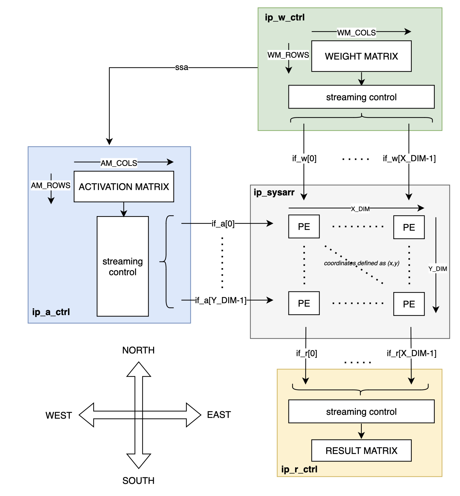

# Systolic Array

## Overview
Suppose we have two matrices **A** (activation data) and **W** (weights), with `dim(A) = AR x AC` and `dim(W) = WR x WC`. We wish to compute  **A*****W** (ie. matmul).

This repository provides a _parameterized_ systolic array implementation for matmul, supporting almost any arbitrary value of `dim(A)` and `dim(W)`. The dimensions of the systolic array will automatically scale according to the values of `dim(A)` and `dim(W)` provided.

Also supported are...
- Any arbitrary data-width of the matrix elements
- Back-to-back (b2b) matmul(s) to any arbitrary depth

Both design and verification files are located under their respective subfolders, along with a `makefile` in this pwd for running simulations/viewing waveforms.

### Architectural assumptions
1. For an arbitrary PE element performing `(a*w)+b`, we assume it can be done in a single cycle (ie. fused MAC)
2. Reset signal is synchronous
3. No backpressure mechanism (eg. incoming **A** values being streamed into the systolic array cannot be backpressured)
4. Data-width of **A** and **W** elements must be similar

### Architectural limitations
1. All `dim(A)` and `dim(W)` combinations **except** `AR < AC` is supported.
  - `AR < AC` requires buffering activation data, still WIP (under `activation_buffer` branch)
2. b2b **A*****W** must be of similarly-size dimensions
- As the design has to be recompiled if either `dim(A)` or `dim(W)` changes, it is not possible to have a "runtime" change in their sizes
3. No support for "partial" matmul
- Given an arbitrary **A*****W** matmul operation, the entire **A** and **W** matrices have to be streamed in as a whole into the systolic array. ie. The matmul algorithm below is not supported
    1. Partition matrix into sub-matrices (sm)
    2. Stream in first sub-matrix, let's call it `sm0`
    3. Perform matmul on `sm0`
    4. Store partial results of `sm0` somewhere
    5. Stream in next sub-matrix, let's call it `sm1`
    6. Perform matmul on `sm1`
    7. ...
    8. Obtain final result by summing across partial results

## Design
### Block Diagram

### Functionality
- `ip_a_ctrl` - Streams out activation data to systolic array
- `ip_w_ctrl` - Streams out weight data to systolic array
- `ip_sysarr` - Instantiation of PE-grid and PE-to-PE connections
- `ip_pe` - Performs a singular MAC. Supports weight-buffering
- `ip_r_ctrl` - Receives stream of result(s) from `ip_sysarr`, packing them into the correct indices of the result matrix

## Verification
The **A** and **W** to be streamed into the systolic array are generated under `ip_a_ctrl` and `ip_w_ctrl` respectively. To ease debugging, each element is derived from a running counter that has been initialised to a starting seed.

Under `verif/tb_top.sv`, there is a scoreboard model that snoops on `valid` and `data` outputs from `ip_r_ctrl`.

The scoreboard (separately) computes the expected result, and compares it against the RTL output from `ip_r_ctrl`. Any discrepancy will be flagged as a `$fatal`.
### Prerequisites
1. Verilator
- `Verilator 5.042 2025-11-02 rev v5.042` tested and works
2. gtkwave (any version should suffice)
### How to run
Run any of the `make` commands below to compile and run the simulation executable. A `wave.vcd` file will be generated, which can then be viewed with `gtkwave`
- `make sample` - Configures the RTL model to `dim(A)=dim(B)=(3x3)`, with `DAT_W=5`
- `make run` - Configures the RTL model with the default parameters under `tb_top.sv`
- `make sweep` - Suite of tests that run sequentially, each with different RTL model parameters. Any test that fails will immediately terminate the sweep.

### Addendum: Sweeps performed
- Degenerate systolic array (ie. one element PE)
  - {AR=1, AC=1}, {WC=1}
  - {AR=1, AC=1}, {WC=4}
- Square matmuls
  - {AR=2, AC=2}, {WC=2}
  - {AR=3, AC=3}, {WC=3}
  - {AR=4, AC=4}, {WC=4}
  - {AR=5, AC=5}, {WC=5}
- Non-square matmuls
  - {AR=2, AC=1}, {WC=1}
  - {AR=3, AC=3}, {WC=1}
  - {AR=3, AC=3}, {WC=4}
  - {AR=4, AC=3}, {WC=4}
  - {AR=6, AC=1}, {WC=6}
  - {AR=6, AC=2}, {WC=1}
  - {AR=6, AC=2}, {WC=3}
